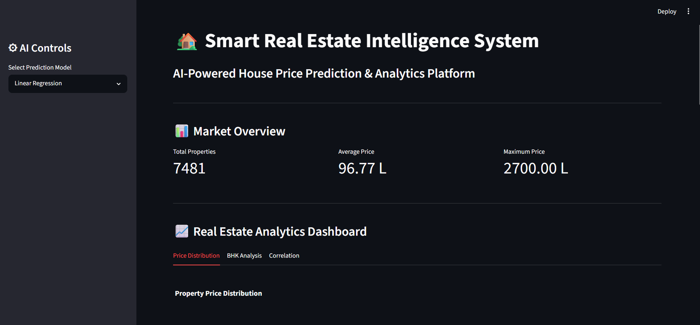
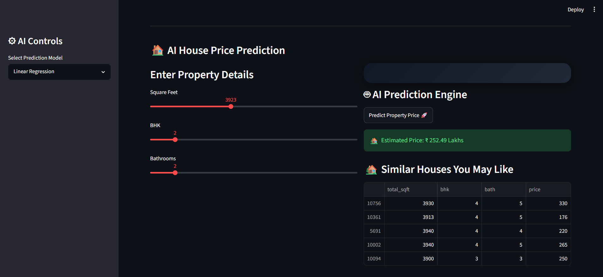
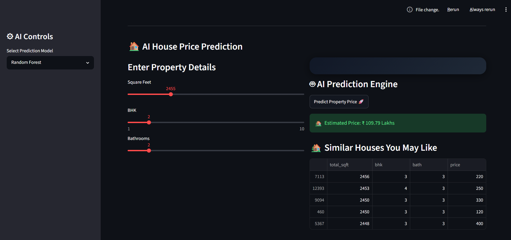
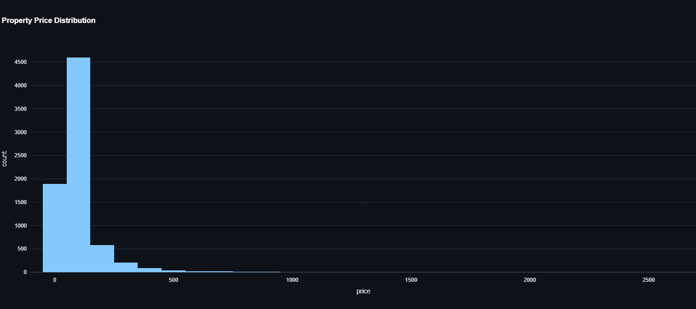
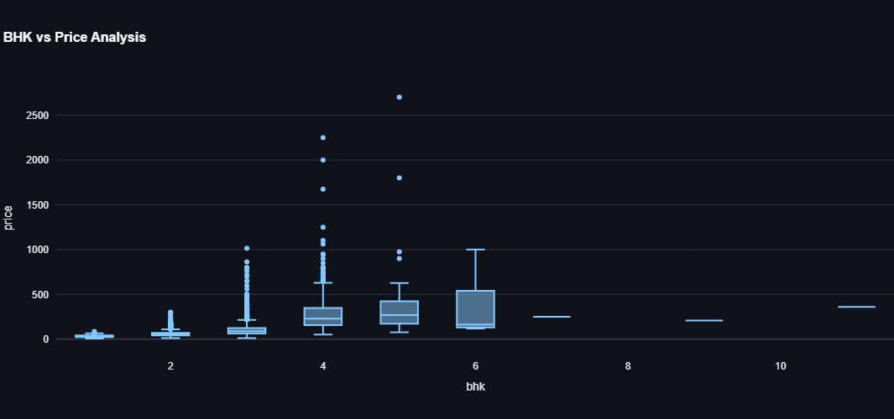
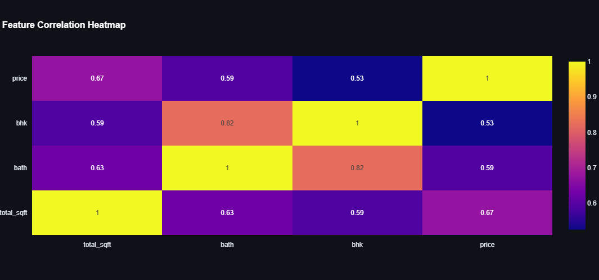

# 🏡 Smart Real Estate Intelligence System


<p align="center">
  
</p>

<p align="center">
  <b>End-to-End Machine Learning Platform for Real Estate Price Prediction & Analytics</b>
</p>

<p align="center">
  
  
  
  
</p>

## 🚀 Live Demo

<p align="center">
  👉 https://house-price-prediction-2026.streamlit.app
</p>

<p align="center">
  🔥 Try the interactive ML dashboard live
</p>

## 📌 Project Overview

The Smart Real Estate Intelligence System is a production-style ML project that simulates a real-world property analytics platform similar to 99acres / Housing.com.

It goes beyond simple prediction by integrating:

- 🧠 Machine Learning price prediction  
- 📊 Data analytics dashboard  
- 🔥 Feature engineering (luxury scoring, transformations)  
- 📈 Data visualization insights  
- 🏘 Similar property recommendations  
- 🌐 Interactive Streamlit web application  

---

## 🎯 Key Features

### 🧠 1. Machine Learning Price Prediction

Predicts house prices based on:

- Square Feet  
- BHK  
- Bathrooms  
- Luxury Score  

---

### 📸 Prediction Result

  


Models used:

- Linear Regression  
- Ridge Regression  
- Random Forest Regressor  

---

## 📊 2. Real Estate Analytics Dashboard

### Analytics Dashboard


Interactive insights including:

- Price distribution analysis  
  

- BHK vs price trends  
  

- Correlation heatmap  
  

- Market behavior visualization  

---

## 🏆 3. Luxury Classification Engine

Automatically categorizes properties into:

- Budget  
- Mid-range  
- Luxury  

Based on engineered rules using:

- Area  
- BHK  
- Structural features  

---

## 🏘 4. Similar Property Insights (Recommendation Layer)

Suggests similar houses based on:

- Size similarity  
- BHK match  
- Bathroom configuration  

Simulates real estate platforms like:

Zillow / 99acres recommendation systems  

---

## 🌐 5. Interactive Web App (Streamlit)

Clean UI with animated background  
Real-time predictions  
Interactive sliders  
Dynamic analytics dashboard  

---

## 🧠 Machine Learning Pipeline

### 1. Data Cleaning
- Removed null values  
- Handled inconsistent data (e.g. "2100 - 2850" ranges)  
- Standardized numerical features  

### 2. Feature Engineering
- Extracted BHK from text fields  
- Created luxury feature:

```python

luxury = 1 if sqft > 3000 or bhk >= 4 else 0

3. Model Training
Linear Regression
Ridge Regression
Random Forest

4. Model Evaluation

Model Performance:

Linear Regression ~0.52
Ridge Regression ~0.52
Random Forest ~0.65
📊 Visualizations

All visual insights are stored in:

visuals/

Includes:

Price distribution
BHK vs price
Correlation heatmap
Feature importance
Model comparison
Streamlit UI screenshots

🏗 Project Architecture

data → cleaning → feature engineering → ML training → model saving → Streamlit app

📂 Project Structure

HousePricePrediction/

├── app/
│   └── app.py
│
├── src/
│   ├── data_cleaning.py
│   ├── prediction.py
│   ├── analytics.py
│   ├── utils.py
│   └── recommender.py
│
├── models/
│   ├── lr.pkl
│   ├── ridge.pkl
│   ├── rf.pkl
│
├── data/
│   └── Bengaluru_House_Data.csv
│
├── visuals/
│   ├── price_distribution.png
│   ├── bhk_vs_price.png
│   ├── correlation_heatmap.png
│   ├── app_homepage.png
│
├── requirements.txt
└── README.md
⚙️ Tech Stack

## ⚙️ Tech Stack

**Languages:** Python  
**ML:** Scikit-learn, Pandas, NumPy  
**Visualization:** Matplotlib, Seaborn, Plotly  
**Frontend:** Streamlit  
**Deployment:** Streamlit Cloud

🚀 How to Run Locally
git clone https://github.com/saikrishna-211/house-price-prediction.git

cd HousePricePrediction

pip install -r requirements.txt

streamlit run app/app.py

💡 Key Learnings
-End-to-end ML pipeline design
-Feature engineering for real-world datasets
-Model comparison and evaluation
-Recommendation system logic
-Building interactive dashboards
-Deploying ML apps using Streamlit

🔥 Business Impact
This project simulates a real-world property intelligence system that can be used for:

-Real estate price estimation
-Market trend analysis
-Property recommendation systems
-Investment decision support

---


## 👨‍💻 Author

**Sai Krishna**  
B.Tech Computer Science Engineering  

💡 Machine Learning | Data Science | AI Systems

---

<p align="center">
  ⭐ If you like this project, please give a star!
</p>
